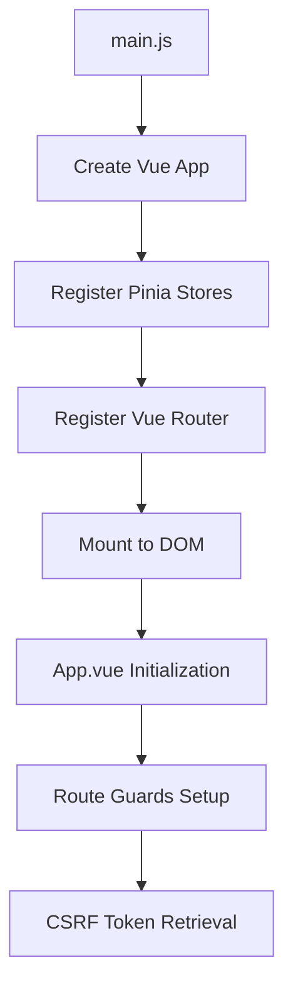
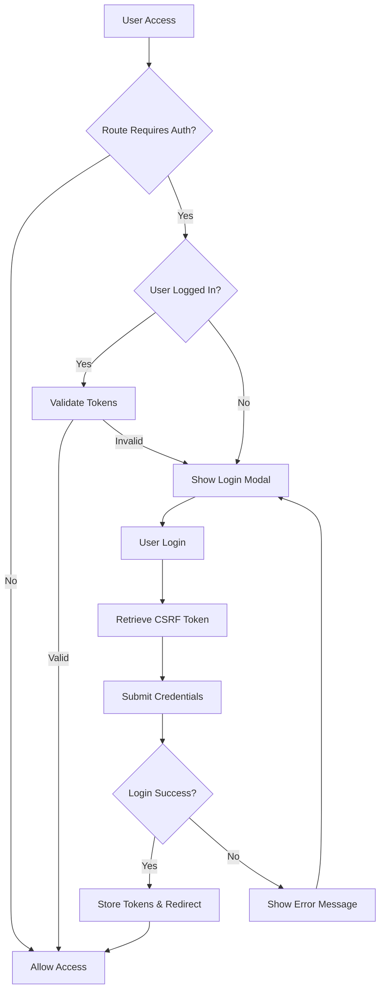

# EDGERACK Access - Industrial Cooling Unit Management System

A modern Vue.js 3 web application for monitoring and controlling Enconnex EDGERACK cooling units in data center environments. Built with a focus on industrial reliability, real-time monitoring, and responsive design.

## 🏗️ Architecture Overview

EDGERACK Access follows a client-server architecture with clear separation of concerns:

```
┌─────────────────────────┐     ┌──────────────────────────┐
│     Client (Vue.js)     │────▶│    Server (Backend)      │
│                         │     │                          │
│ ┌─────────────────────┐ │     │ ┌──────────────────────┐ │
│ │   User Interface    │ │     │ │      REST API        │ │
│ │   Components        │ │     │ │    /v1/api/*         │ │
│ └─────────────────────┘ │     │ └──────────────────────┘ │
│                         │     │                          │
│ ┌─────────────────────┐ │     │ ┌──────────────────────┐ │
│ │  State Management   │ │     │ │   Authentication     │ │
│ │   (Pinia Stores)    │ │     │ │   & Authorization    │ │
│ └─────────────────────┘ │     │ └──────────────────────┘ │
│                         │     │                          │
│ ┌─────────────────────┐ │     │ ┌──────────────────────┐ │
│ │   HTTP Client       │ │     │ │   MODBUS Interface   │ │
│ │    (Axios)          │ │     │ │   Cooling Units      │ │
│ └─────────────────────┘ │     │ └──────────────────────┘ │
└─────────────────────────┘     └──────────────────────────┘
```

## 🚀 Features

### 🎨 Modern UI/UX
- **Responsive Design**: Optimized for desktop, tablet, and mobile devices
- **Dark Theme**: Industrial-grade dark interface optimized for data center environments
- **Real-time Updates**: Live data refresh every second for critical monitoring
- **Interactive Controls**: Intuitive sliders, toggles, and modal interfaces

### 🔐 Security & Authentication
- **JWT Token Authentication**: Secure API access with automatic token refresh
- **CSRF Protection**: Cross-site request forgery protection
- **Route Guards**: Protected routes with automatic login redirection
- **Session Persistence**: Secure session management with automatic logout

### 📊 Monitoring & Control
- **Real-time Metrics**: Temperature, humidity, fan speeds, and system status
- **Alarm Management**: Visual and audible alarm notifications
- **Event Logging**: Comprehensive system event tracking with filtering
- **System Diagnostics**: CPU, memory, storage, and network monitoring

### 🌐 Network Management
- **Dual Network Interfaces**: Primary and secondary network monitoring
- **IPv4/IPv6 Support**: Complete network stack monitoring
- **NTP Synchronization**: Network time protocol status and configuration

## 📁 Project Structure

```
src/
├── assets/                     # Static assets and global styles
│   ├── tailwind.css           # Custom styles and theme definitions
│   ├── persistState.js        # State persistence utility
│   ├── sha256Worker.js        # Crypto worker for password hashing
│   └── version.js             # Version reporting utility
├── components/                 # Reusable UI components
│   ├── SiteNavigation.vue     # Main navigation bar
│   ├── LoginModal.vue         # Authentication modal
│   ├── LogoutModal.vue        # Logout confirmation modal
│   ├── ForgotPassword.vue     # Password recovery modal
│   ├── SliderTempsModal.vue   # Temperature adjustment modal
│   ├── ToastComponent.vue     # Toast notification system
│   ├── AlertModal.vue         # Alert dialog component
│   └── UpdateDateTimeModal.vue # Date/time configuration modal
├── composables/               # Vue composition functions
│   └── useStateMachine.js     # State machine composable
├── stores/                    # Pinia state management
│   ├── user.js               # User authentication store
│   ├── stateMachine.js       # Application state machine
│   ├── toastManager.js       # Toast notification manager
│   └── index.js              # Store configuration
├── views/                     # Page-level components
│   ├── HomeView.vue          # Main dashboard
│   ├── RCU.vue               # Cooling unit management
│   ├── Config.vue            # System configuration
│   ├── User.vue              # User management
│   └── Upgrade.vue           # System upgrade interface
├── router/                    # Vue Router configuration
│   └── index.js              # Route definitions and guards
├── icons/                     # SVG icon components
│   ├── alert.svg             # Alert/warning icons
│   ├── fan.svg               # Fan status icons
│   ├── cool.svg              # Cooling indicators
│   └── fire.svg              # Heating indicators
├── App.vue                    # Root application component
├── main.js                    # Application entry point
└── bus.js                     # Event bus for component communication
```

## 🔧 Technical Stack

### Frontend Framework
- **Vue.js 3**: Progressive JavaScript framework with Composition API
- **Vite**: Fast build tool with hot module replacement
- **Vue Router 4**: Official router for Vue.js with navigation guards

### State Management
- **Pinia**: Modern state management library for Vue
- **Persistent State**: Automatic state persistence across sessions

### Styling & UI Components
- **TailwindCSS**: Utility-first CSS framework
- **Flowbite Vue**: Component library built on TailwindCSS
- **Lato Font**: Professional typography for industrial interfaces

### HTTP & API Communication
- **Axios**: Promise-based HTTP client with interceptors
- **Automatic Base URL**: Dynamic API endpoint configuration
- **Request/Response Interceptors**: Automatic token handling

## 🏃‍♂️ Getting Started

### Prerequisites
- Node.js 20+
- npm or yarn package manager

### Installation

1. **Clone the repository**
   ```bash
   git clone <your-repository-url>
   cd edgerack-access
   ```

2. **Install dependencies**
   ```bash
   npm install
   ```

3. **Start development server**
   ```bash
   npm run dev
   ```
   The application will be available at `http://localhost:5173`

4. **Build for production**
   ```bash
   npm run build
   ```

## 🎯 Application Workflow

### 1. Application Bootstrap


### 2. Authentication Flow


### 3. Real-time Data Flow
```mermaid
graph TD
    A[Component Mount] --> B[Start Data Polling]
    B --> C[Fetch All Data (/v1/api/all)]
    C --> D[Update Component State]
    D --> E[Render UI Updates]
    E --> F[Wait 1 Second]
    F --> C
    G[Component Unmount] --> H[Clear Intervals]
```

## 🎨 UI/UX Design Philosophy

### Industrial Aesthetic
- **Dark Theme**: Reduces eye strain in data center environments
- **High Contrast**: Ensures readability in various lighting conditions
- **Consistent Spacing**: 8px grid system for visual harmony
- **Professional Typography**: Lato font family for clarity

### Responsive Design Principles
- **Mobile-First**: Progressive enhancement from mobile to desktop
- **Breakpoint Strategy**:
  - `sm`: 640px+ (tablets)
  - `md`: 768px+ (small laptops)
  - `lg`: 1024px+ (desktops)
  - `xl`: 1280px+ (large displays)

### Component Hierarchy
```
App.vue
├── SiteNavigation.vue (Global)
├── LoginModal.vue (Authentication)
├── LogoutModal.vue (Authentication)
├── ForgotPassword.vue (Authentication)
└── RouterView
    ├── HomeView.vue (Dashboard)
    │   ├── ToastComponent.vue
    │   ├── SliderTempsModal.vue
    │   └── Cabinet Status Grids
    ├── RCU.vue (Cooling Management)
    ├── Config.vue (System Settings)
    ├── User.vue (User Management)
    └── Upgrade.vue (System Updates)
```

## 🔄 Client-Server Communication

### API Endpoints Structure
```
/v1/api/
├── all                        # Complete system status
├── timestamp                  # Server timestamp
├── server/time               # Current server time
├── edgerack/0/
│   ├── rcu/0                 # Cooling unit control
│   ├── realtime/
│   │   ├── uptime           # System uptime
│   │   └── sw-revision      # Software version
│   └── config/
│       └── general          # General configuration
├── events/
│   ├── all                  # Event log entries
│   └── count               # Event count
└── alarms/
    └── active/count         # Active alarm count
```

### Request/Response Flow
1. **Authentication**: JWT tokens in Authorization header
2. **CSRF Protection**: X-CSRF-TOKEN header on state-changing requests
3. **Content Type**: application/json for API requests
4. **Error Handling**: Axios interceptors for global error management

### Real-time Updates
- **Polling Interval**: 1000ms for critical data
- **Background Updates**: Event log count checks
- **State Synchronization**: Server state takes precedence over local state

## 🔐 Security Implementation

### Authentication Strategy
```javascript
// Token-based authentication with automatic refresh
const authFlow = {
  login: 'POST /v1/api/auth/login',
  refresh: 'POST /v1/api/auth/refresh',
  logout: 'POST /v1/api/auth/logout',
  validate: 'GET /v1/api/auth/validate'
}
```

### Route Protection
```javascript
const authRequiredRoutes = ['config', 'user', 'upgrade'];
// Automatic redirection to login for protected routes
```

### CSRF Protection
- Token retrieved on application initialization
- Included in all state-changing requests
- Automatic token refresh on expiration

## 📊 State Management Architecture

### User Store (`stores/user.js`)
- Authentication state and tokens
- User profile information
- Login/logout actions
- Token validation and refresh

### State Machine Store (`stores/stateMachine.js`)
- Application state transitions
- Loading states and error handling
- Navigation state management
- Retry logic for failed operations

### Toast Manager Store (`stores/toastManager.js`)
- Notification system
- Success, error, and info messages
- Auto-dismiss functionality
- Queue management for multiple toasts

## 🎛️ Component Communication

### Event Bus Pattern
```javascript
// Global event bus for cross-component communication
bus.emit('show-login-modal');
bus.on('hide-login-modal', callback);
```

### Props & Emit Pattern
```javascript
// Parent-child component communication
<SliderTempsModal
  :temperatureValue="targetTemperatureValue"
  @submit="handleUpdateSupplyAirTarget"
/>
```

### Store-based Communication
```javascript
// Shared state across components
const userStore = useUserStore();
const isLoggedIn = computed(() => userStore.isLoggedIn);
```

## 🚀 Deployment on Replit

### Development Deployment
1. **Import Repository**: Connect your GitHub repository to Replit
2. **Automatic Detection**: Replit automatically detects the Vue.js project
3. **Dependencies**: Automatic npm install on first run
4. **Development Server**: `npm run dev` serves on port 5173

### Production Deployment
1. **Build Process**: `npm run build` creates optimized distribution
2. **Static Hosting**: Deploy the `dist` folder to Replit hosting
3. **Environment Variables**: Configure through Replit secrets
4. **Custom Domain**: Optional custom domain configuration

### Replit Configuration
```toml
# .replit file configuration
modules = ["vue-node-20", "nodejs-20", "web"]
run = "npm run dev"

[deployment]
run = ["sh", "-c", "npm run dev"]

[[ports]]
localPort = 5173
externalPort = 80
```

## 🧪 Testing & Development

### Development Workflow
1. **Hot Reload**: Instant updates during development
2. **Error Overlay**: Vite's built-in error handling
3. **Console Integration**: Browser dev tools integration
4. **API Mocking**: Graceful degradation when API unavailable

### Browser Compatibility
- **Modern Browsers**: Chrome 90+, Firefox 88+, Safari 14+
- **Mobile Browsers**: iOS Safari 14+, Chrome Mobile 90+
- **Progressive Enhancement**: Graceful fallbacks for older browsers

## 📈 Performance Optimization

### Bundle Optimization
- **Tree Shaking**: Automatic unused code elimination
- **Code Splitting**: Route-based code splitting
- **Asset Optimization**: Automatic image and font optimization
- **Minification**: Production build minification

### Runtime Performance
- **Virtual Scrolling**: Efficient large list rendering
- **Lazy Loading**: Component lazy loading for routes
- **Debounced Updates**: Optimized real-time data handling
- **Memory Management**: Proper cleanup of intervals and listeners

## 🛠️ Configuration Options

### Environment Configuration
```javascript
// Automatic environment detection
const baseURL = `https://${window.location.hostname}`;
axios.defaults.baseURL = baseURL;
```

### Theme Customization
```css
/* Custom CSS variables in tailwind.css */
:root {
  --background: hsl(256, 89%, 4%);
  --foreground: hsl(213, 31%, 91%);
  /* Additional theme variables */
}
```

### Build Configuration
```javascript
// vite.config.js
export default defineConfig({
  plugins: [vue(), svgLoader()],
  resolve: {
    alias: {
      '@': fileURLToPath(new URL('./src', import.meta.url))
    }
  }
});
```

## 🐛 Troubleshooting

### Common Issues

1. **Build Errors**
   - Check `tailwind.css` syntax
   - Verify all imports are correct
   - Clear node_modules and reinstall

2. **Authentication Issues**
   - Verify CSRF token retrieval
   - Check token expiration
   - Validate API endpoints

3. **Real-time Data Issues**
   - Check network connectivity
   - Verify API endpoint availability
   - Monitor browser console for errors

### Debug Mode
```javascript
// Enable debug logging
localStorage.setItem('debug', 'true');
```

## 📋 Available Scripts

- `npm run dev` - Start development server with hot reload
- `npm run build` - Build for production deployment
- `npm run preview` - Preview production build locally

## 🤝 Contributing

### Development Setup
1. Fork the repository
2. Create a feature branch
3. Make your changes
4. Test thoroughly
5. Submit a pull request

### Code Style
- ESLint configuration for consistent code style
- Prettier for automatic code formatting
- Vue.js style guide compliance

## 📄 License

This project is proprietary software owned by Enconnex. All rights reserved.

## 🆘 Support

For technical support or questions:
- Create an issue in the repository
- Contact the development team
- Check the troubleshooting section above

---

**EDGERACK Access** - Industrial cooling management made simple, reliable, and efficient.
