# EDGERACK Access - Enconnex

A Vue.js 3 web application for managing Enconnex EDGERACK cooling units with a modern, responsive interface supporting multiple themes.

## 🚀 Features

- **Multi-theme Support**: Super Dark, Dark, and Light themes with persistent state
- **Authentication System**: Secure login with CSRF protection and token validation
- **Responsive Design**: Built with TailwindCSS and Flowbite components
- **Hot Module Replacement**: Vite-powered development with instant updates
- **State Management**: Pinia stores for user authentication and theme management
- **Route Protection**: Authentication-required routes with automatic redirects

## 🛠 Tech Stack

- **Frontend Framework**: Vue.js 3 (Composition API)
- **Build Tool**: Vite
- **Styling**: TailwindCSS + Flowbite
- **State Management**: Pinia
- **Routing**: Vue Router 4
- **HTTP Client**: Axios
- **Authentication**: JWT tokens with CSRF protection

## 📁 Project Structure

```
src/
├── assets/
│   ├── tailwind.css          # Custom styles and theme overrides
│   ├── persistState.js       # State persistence utility
│   └── sha256Worker.js       # Crypto worker for hashing
├── components/
│   ├── SiteNavigation.vue    # Main navigation component
│   ├── LoginModal.vue        # Authentication modal
│   ├── ThemeToggle.vue       # Theme switching component
│   └── ...                   # Other UI components
├── stores/
│   ├── user.js              # User authentication store
│   ├── theme.js             # Theme management store
│   └── index.js             # Pinia configuration
├── views/
│   ├── HomeView.vue         # Dashboard/landing page
│   ├── RCU.vue              # Cooling unit management
│   ├── Config.vue           # System configuration
│   ├── User.vue             # User management
│   └── Upgrade.vue          # System upgrades
├── router/
│   └── index.js             # Route definitions
├── App.vue                  # Root component
└── main.js                  # Application entry point
```

## 🔧 Installation & Setup

### Prerequisites
- Node.js 20+ 
- npm or yarn

### Local Development

1. **Clone the repository**
   ```bash
   git clone <repository-url>
   cd edgerack-access
   ```

2. **Install dependencies**
   ```bash
   npm install
   ```

3. **Start development server**
   ```bash
   npm run dev
   ```
   The application will be available at `http://localhost:5173`

4. **Build for production**
   ```bash
   npm run build
   ```

## 🔄 Application Workflow & UI/UX Flow Diagrams

### 1. Application Bootstrap & Architecture


### 2. Authentication & Route Protection Flow


### 3. Real-Time Data Flow & Dashboard Updates

```mermaid
graph TD
    A[HomeView Mounted] --> B[Start 1-Second Interval]
    B --> C[Fetch /v1/api/all]
    C --> D[Parse Cooling Unit Data]
    D --> E[Update Temperature Readings]
    D --> F[Update System Status]
    D --> G[Update Network Info]
    D --> H[Update Alarms/Alerts]
    E --> I[Convert °F/°C Based on Settings]
    F --> J[Update Status Badges<br/>ON/OFF, Supply/Return Air]
    G --> K[Update Network Link Status LEDs]
    H --> L[Show/Hide Alarm Banners]
    I --> M[Display in Custom Grid Components]
    J --> M
    K --> M
    L --> M
    M --> N[Update Status Icons<br/>Fan/Cooling/Heating/Alert]
    N --> O[Wait 1 Second]
    O --> B
    B --> P[Also Fetch Event Logs Count]
    P --> Q[Show Background Difference Badge]
```


### 4. User Control Interaction Flow


### 5. Theme Management & UI State Flow

```mermaid
graph TD
    A[App Initialization] --> B[Load Theme from localStorage]
    B --> C[Apply Theme Classes to Document]
    C --> D[Initialize Theme Store]
    D --> E[User Clicks Theme Toggle]
    E --> F[Cycle Through Themes<br/>Super Dark → Dark → Light]
    F --> G[Update Store State]
    G --> H[Apply CSS Classes to <body>]
    H --> I[Update All Component Styles]
    I --> J[Save to localStorage]
    J --> K[Apply CSS Custom Properties]
    K --> L[Update Flowbite Components]
    L --> M[Update Custom Grid Components]
    M --> N[Update Card Components]
    N --> O[Theme Applied Successfully]
```


### 6. Modal System & User Interactions

```mermaid
graph TD
    A[User Action Triggers Modal] --> B[Event Bus System]
    B --> C[Login Required]
    B --> D[Logout Confirmation]
    B --> E[Forgot Password]
    B --> F[Temperature Adjustment]
    
    C --> G[LoginModal.vue]
    G --> H[Username/Password Form]
    H --> I[Submit Credentials]
    I --> J[Authentication API Call]
    J --> K{Success?}
    K -->|Yes| L[Close Modal & Enable Controls]
    K -->|No| M[Show Error Message]
    
    D --> N[LogoutModal.vue]
    N --> O[Confirmation Buttons]
    O --> P[Logout API Call]
    P --> Q[Clear Tokens & Redirect]
    
    E --> R[ForgotPassword.vue]
    R --> S[Email Input Form]
    S --> T[Password Reset Request]
    
    F --> U[SliderTempsModal.vue]
    U --> V[Temperature Slider Input]
    V --> W[Min/Max Validation]
    W --> X[Convert °C to °F if needed]
    X --> Y[Submit to API]
    Y --> Z[Update Real-time Display]
```


### 7. Event Log & System Monitoring Flow


### 8. Responsive Design & Mobile Experience


### 9. Error Handling & Toast Notification System


### 10. Component Hierarchy & Data Flow


## 🎨 Theme System

The application supports three themes:

- **Super Dark**: Deep dark theme with `#060511` backgrounds
- **Dark**: Standard dark theme with CSS variables
- **Light**: Light theme with high contrast

Theme switching is handled by the `ThemeStore` and persisted across sessions.

### Border Radius Standards

The application uses consistent border radius values across all components:

**Primary Radius (`0.8rem`)** - Used for most containers:
- Cards (`.card`, `.card-secondary`, `.card-tertiary`, `.card-compact`)
- Form elements (`.form-input`, `.form-textarea`, `.form-select`)
- Panels (`.panel`, `.panel-compact`)
- Grids and tables (`.custom-grid`, `.data-table`)
- Modal components (`.modal-content`, `.modal-body`)
- Utility classes (`.glass-effect`, `.tooltip`, `.progress-bar`, `.alert`)

**Secondary Radius (`0.4rem`)** - Used for interactive elements:
- Buttons (`.btn-primary`, `.btn-secondary`, `.btn-tertiary`, `.btn-danger`)
- Navigation links (`.nav-link` on hover/active states)

**Icon Button Radius (`0.5rem`)** - Used for:
- Icon-only buttons (`.btn-icon`)

**Sharp Corners (`0`)** - Used for:
- Dropdown menus (`.nav-dropdown`, `.dropdown-menu`)
- Code text elements (`.text-code`)

**Partial Rounding** - Used for connected elements:
- Panel/Modal headers: `0.8rem 0.8rem 0 0` (top corners only)
- Panel/Modal footers: `0 0 0.8rem 0.8rem` (bottom corners only)

This consistent approach ensures a cohesive visual design across all three themes.

## 🔐 Security Features

- **CSRF Protection**: Tokens retrieved and validated on each request
- **JWT Authentication**: Access tokens for API authorization
- **Route Guards**: Protected routes require authentication
- **Token Validation**: Automatic token refresh and validation

## 🚀 Deployment

### Replit Deployment (Recommended)

1. **Push to Replit**
   - Import your GitHub repository to Replit
   - Replit will automatically detect the Vue.js project

2. **Configure Run Command**
   ```bash
   npm run dev
   ```

3. **Deploy to Production**
   - Use Replit's deployment feature
   - The app will be accessible via your Replit domain

### Manual Deployment

1. **Build the application**
   ```bash
   npm run build
   ```

2. **Deploy the `dist` folder** to your hosting provider

## 📋 Available Scripts

- `npm run dev` - Start development server with hot reload
- `npm run build` - Build for production
- `npm run preview` - Preview production build locally

## 🔧 Configuration

### Environment Variables
Set up the following in your environment:
- API base URL is automatically set to current hostname
- CSRF tokens are retrieved dynamically

### Route Configuration
Protected routes are defined in `App.vue`:
```javascript
const authRequiredRoutes = ['config', 'user', 'upgrade'];
```

## 🐛 Troubleshooting

### Common Issues

1. **CSS Build Errors**
   - Check `tailwind.css` for syntax errors
   - Ensure proper CSS property formatting

2. **Authentication Issues**
   - Verify CSRF token endpoint is accessible
   - Check network requests in browser dev tools

3. **Theme Not Persisting**
   - Ensure localStorage is available
   - Check `persistState.js` configuration

## 🤝 Contributing

1. Fork the repository
2. Create a feature branch: `git checkout -b feature-name`
3. Commit changes: `git commit -am 'Add feature'`
4. Push to branch: `git push origin feature-name`
5. Submit a Pull Request

## 📄 License

This project is proprietary software for Enconnex EDGERACK systems.

---

For support or questions, please contact the development team.
